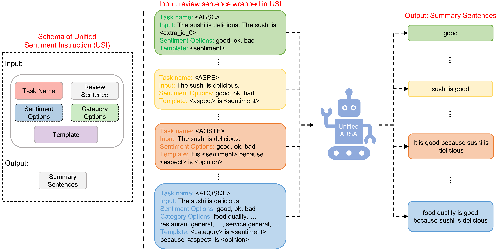

# UnifiedABSA: A Unified ABSA Framework Based on Multi-task Instruction Tuning

>Are you interested in ABSA? Welcome to view our curated [ABSA-Reading-List](https://github.com/NUSTM/ABSA-Reading-List) . 

>Are you troubled by no or few labeled data for ABSA? Feel free to check out our latest work, [FS-ABSA](https://github.com/NUSTM/FS-ABSA) , accepted by SIGIR 2023.


## Overview



In this work, we present **UnifiedABSA**, a general-purpose multi-task ABSA framework based on multi-task instruction-tuning. 
Specifically, 
- we formulate all ABSA tasks as a conditional generation problem. 
- we design unified sentiment instructions (USI) for each task to help the model distinguish between various ABSA tasks.


## Citation

If you find this work helpful, please cite our paper as follows:
```
@article{wang2022unifiedabsa,
  author       = {Zengzhi Wang and
                  Rui Xia and
                  Jianfei Yu},
  title        = {UnifiedABSA: {A} Unified {ABSA} Framework Based on Multi-task Instruction
                  Tuning},
  journal      = {CoRR},
  volume       = {abs/2211.10986},
  year         = {2022},
  url          = {https://doi.org/10.48550/arXiv.2211.10986},
  doi          = {10.48550/arXiv.2211.10986},
  eprinttype    = {arXiv},
  eprint       = {2211.10986},
}
```

## Any Questions?

If you have any questions related to this work, you can open an issue with details or feel free to email Zengzhi(`zzwang@njust.edu.cn`).


## Acknowledgements

Our code is based on [ABSA-QUAD](https://github.com/IsakZhang/ABSA-QUAD). Thanks for their work.

